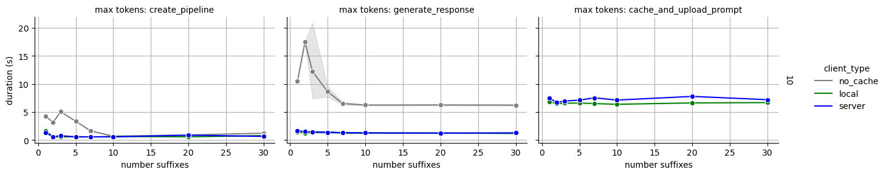

# promptcachedb

Cache LLM prompts to a persistent database

Currently still in progress, but this may be useful if you check some or especially all of the following boxes:

- [ ] Working with open-source LLMs
- [ ] Re-using very long prompts
- [ ] Running multiple LLMs or agents across different servers

## Usage

In the current demo, a prompt is cached, sent to a server, retrieved from the server, and then used locally. You
can test this by:

- Cloning this repo
- [Installing uv](https://docs.astral.sh/uv/getting-started/installation/)
- `uv sync`

### Running the server

To run locally, do `uv run fastapi dev`.

To run with docker, do `docker compose up`.

### Running the demo

`uv run --package promptcachedb-client demo`

The benchmark can be ran with

`uv run --package promptcachedb-client benchmark`

## Example code

```python
from promptcachedb_client.cache_pipeline import pipeline as pc_pipeline
from promptcachedb_client.client import PromptCacheClient


pc_client = PromptCacheClient(client_type="server", cache_server_url="http://localhost:8000", local_cache_path=PROMPT_CACHE_PATH)
pc_pipe = pc_pipeline(model=MODEL_NAME, device=device, client=pc_client)

print("Uploading cached prompts...")
pc_pipe.cache_and_upload_prompt(prompt=INITIAL_PROMPT, prompt_name="project_description")

print("Running model with cached prompt prefix and different prompts")
prompts = ["What could I name this project?", "Tell me about this project", "What are some potential issues with this project?"]

for prompt in prompts:
    response = pc_pipe.generate_with_cache(
        cached_prompt_name="project_description",
        prompt=prompt,
        max_new_tokens=25
    )
    print(prompt)
    print(response)
```

## Benchmarking

The below plots were generated by using `promptcachedb` with a locally hosted server in a container and a client. The prompt was around ~2.6k tokens:



Note that the average amount of time it takes to compute a suffix is significantly lower with `promptcachedb`, as opposed to using a default `pipeline`. There is an upfront cost of caching and uploading the prompt, but this is paid only once.

In the future, I plan to do more benchmarking with various prompt lengths, as well benchmarking a hosted model and `promptcachedb` server (e.g. using a provider like Modal).
